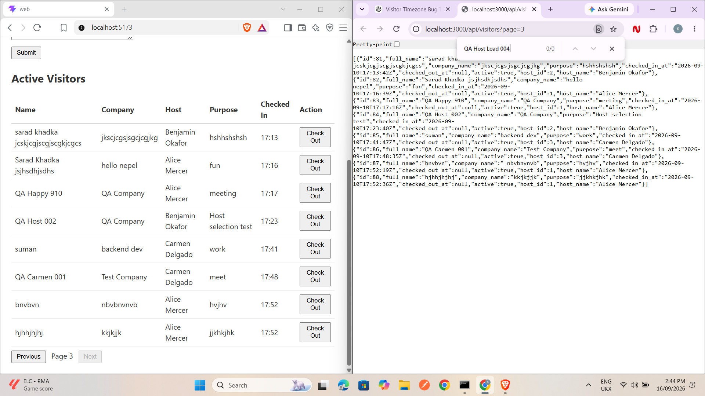
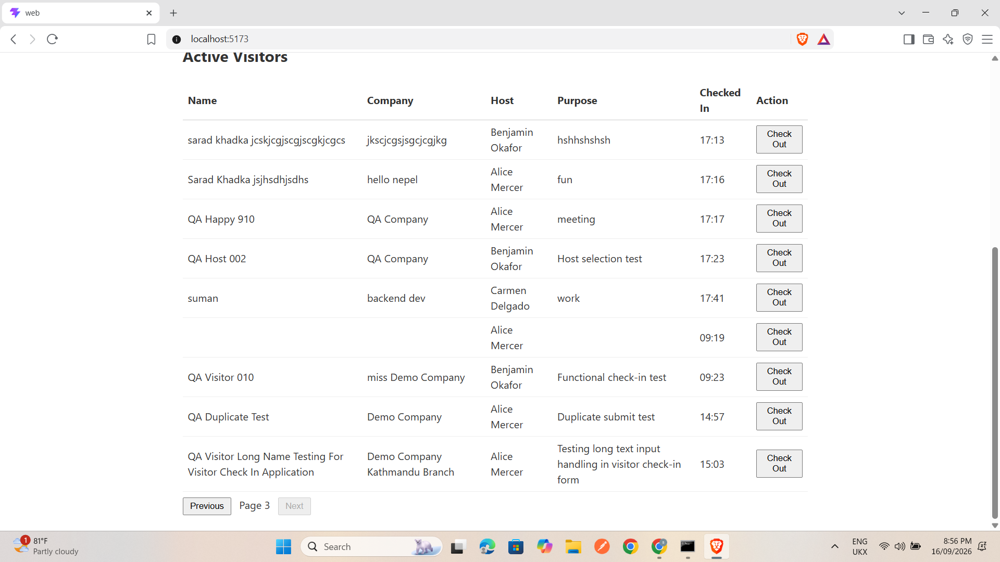
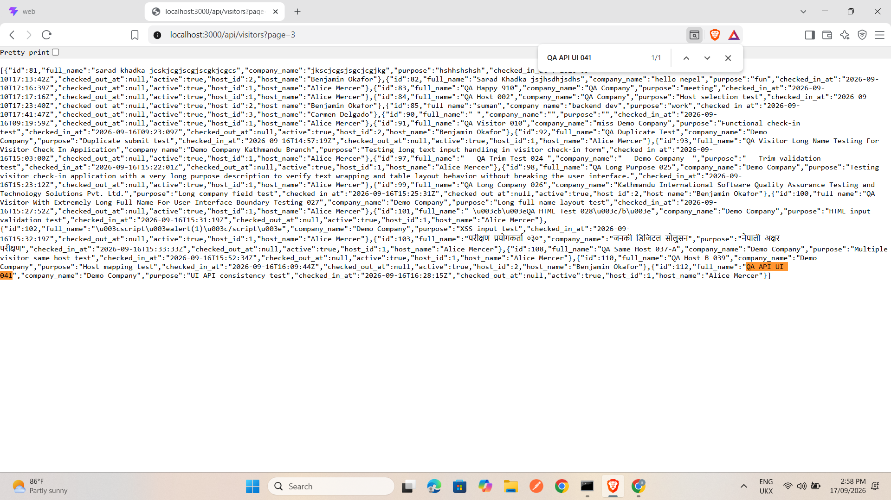
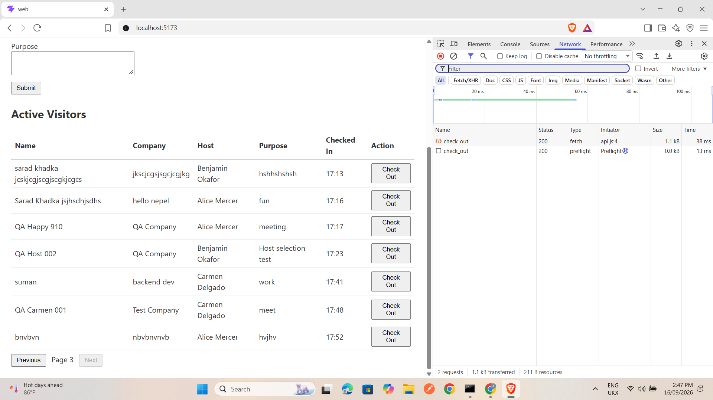
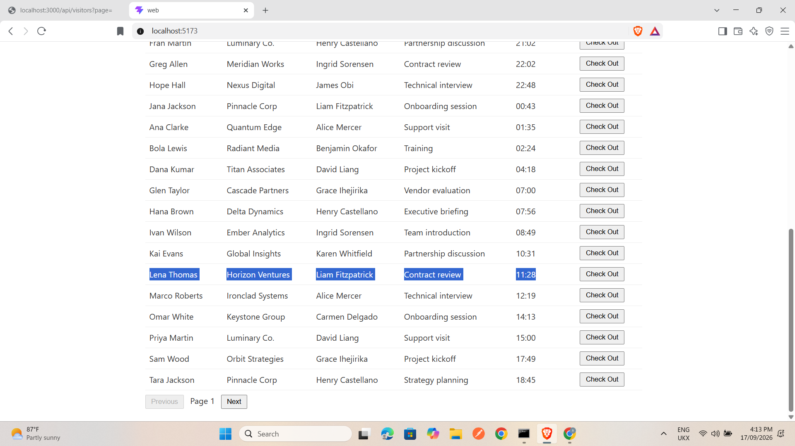
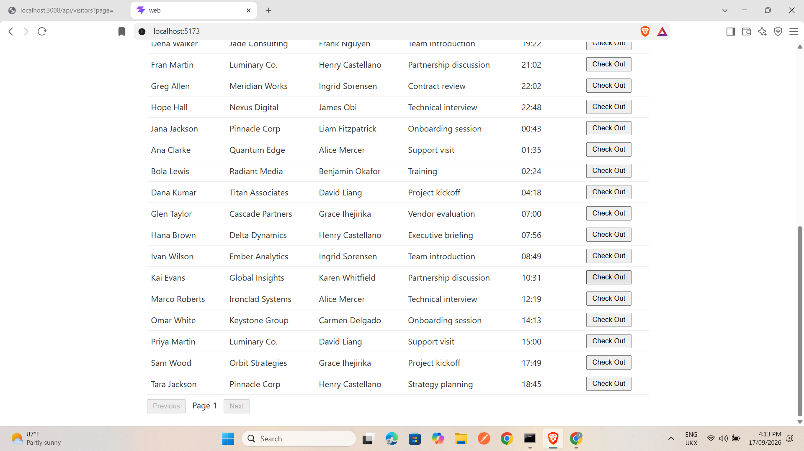
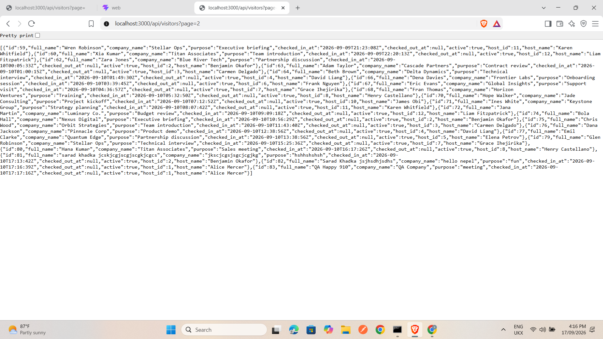

# Visitor Check-in — Defect Report

**Status: FINAL QA triage — 12 findings recorded: 7 confirmed live defects, 4 isolated/source-supported findings requiring integrated confirmation, and 1 measured-risk finding.**

Source reviewed: supplied visitor-checkin-exercise-main source and the user-run Rails/React application. No application code was changed because this submission is for the QA Track. Test-case results and execution evidence are in qa-suite.md and qa-evidence/.

### Screenshot evidence convention

Live UI/API screenshots supplied during execution are stored under `qa-evidence/screenshots/` and embedded below the relevant confirmed defects. For controlled harness, race, and performance-risk findings, executable/log/source evidence is retained instead of treating a static screenshot as proof. Two deactivation screenshots (DEF-006/DEF-007) are referenced as pending because those image files are not present in the currently mounted evidence set.

## DEF-001 — Check-in time displays UTC instead of Nepal local time

- **Summary:** The active-list check-in time is formatted as UTC instead of the receptionist's local time.
- **Type:** Functional / time.
- **Severity:** Medium.
- **Confidence:** Confirmed live.
- **Description:** The frontend uses toISOString() and slices the UTC hour/minute. The browser timezone was confirmed as Asia/Katmandu. API storage in UTC is valid, but the displayed hour/minute is wrong for the receptionist.
- **Steps to Reproduce:**
  1. Check the app in a browser whose timezone is Asia/Katmandu.
  2. Confirm the browser timezone with Intl.DateTimeFormat().resolvedOptions().timeZone.
  3. Check a visitor whose API checked_in_at is 2026-09-16T05:32:41Z (visitor 89 in the recorded run).
  4. Confirm the active-list Checked In value against an independent Kathmandu conversion.
- **Expected Result:** The row represents 11:17 in Nepal (minute-only display).
- **Actual Result:** The row displayed 05:32, the UTC hour/minute, while the browser reported Asia/Katmandu.
- **Evidence:** QA-VIS-030 [fail], user execution 2026-09-16, visitor-89 API response and UI/console evidence.

**Screenshot evidence:**

*The screenshot places the active-list UI beside the API JSON. For example, an API `checked_in_at` value ending in `17:13:42Z` is displayed as `17:13` in the UI rather than being converted to Nepal local time.*

## DEF-002 — Whitespace-only Full Name is accepted

- **Summary:** A Full Name made only of spaces can be registered.
- **Type:** Functional / data validation.
- **Severity:** Medium.
- **Confidence:** Confirmed live.
- **Description:** Browser required validation checks whether the input is non-empty, but there is no trimmed meaningful-name validation. A blank-looking name can enter the active roster.
- **Steps to Reproduce:**
  1. Check the registration form with spaces only in Full Name.
  2. Confirm valid values for Company, Host and Purpose.
  3. Check Submit and inspect the API/list response.
- **Expected Result:** A trimmed-empty Full Name is rejected and no visitor is created.
- **Actual Result:** A visitor with a blank-looking name was created and displayed.
- **Evidence:** QA-VIS-008 [fail] and the supplied manual execution report.

**Screenshot evidence:**

*The active list contains a row with a blank-looking Name while the Host and Checked In values are present, demonstrating that a spaces-only Full Name was accepted.*

## DEF-003 — Leading/trailing whitespace is retained in stored text

- **Summary:** Text normalization is inconsistent; leading whitespace can persist in API data.
- **Type:** Data / usability.
- **Severity:** Low.
- **Confidence:** Confirmed live.
- **Description:** The UI may visually appear trimmed, but the API can return the original whitespace. This makes exact search, display and downstream data quality inconsistent.
- **Steps to Reproduce:**
  1. Check registration with leading/trailing spaces around a Full Name or another text value.
  2. Confirm the saved API JSON after registration.
  3. Check the refreshed list for the same value.
- **Expected Result:** The agreed normalization rule is applied consistently before persistence.
- **Actual Result:** The recorded API response for visitor 107 retained a leading space in full_name (" QA Checkout Retest 036").
- **Evidence:** QA-VIS-024 [fail], supplied API response and manual execution report.

**Screenshot evidence:**

*The API output visibly contains values with surrounding spaces (for example the QA Trim Test record), supporting the normalization inconsistency described above.*

## DEF-004 — Checkout leaves active=true in API responses

- **Summary:** Checkout stores checked_out_at but returns active=true.
- **Type:** Functional / data consistency.
- **Severity:** Medium.
- **Confidence:** Confirmed live and repeatable.
- **Description:** PATCH /check_out completes and the UI removes the row based on checked_out_at, but the response's active flag remains true. This creates contradictory lifecycle state for API consumers.
- **Steps to Reproduce:**
  1. Check an active visitor ID.
  2. Send PATCH /api/visitors/<id>/check_out.
  3. Confirm the response contains a non-null checked_out_at and inspect active.
  4. Repeat with a newly created visitor if needed.
- **Expected Result:** Checkout returns a state consistent with an inactive/checked-out visitor, including active=false if active is part of the response contract.
- **Actual Result:** IDs 115, 117 and the QA Checkout Retest 036 response had a checkout timestamp while active remained true.
- **Evidence:** QA-VIS-005, 036 and 051 [fail]; user PATCH response for id 117.

**Screenshot / response evidence:**

The exact captured checkout response is saved as [`DEF-004-checkout-response-id115.json`](qa-evidence/screenshots/DEF-004-checkout-response-id115.json). It contains both a non-null `checked_out_at` and `"active": true`.

## DEF-005 — Next becomes disabled while another populated page exists

- **Summary:** Checking out a row can strand visitors on a later page.
- **Type:** Functional / pagination.
- **Severity:** High.
- **Confidence:** Confirmed live.
- **Description:** The frontend removes the row from the current local array and infers the last page from the remaining row count. It does not refetch the page or use server pagination metadata after checkout.
- **Steps to Reproduce:**
  1. Check a dataset with at least 21 active visitors and open Page 1.
  2. Confirm Page 2 has records through GET /api/visitors?page=2.
  3. Check out one Page-1 visitor.
  4. Confirm the UI Next control and compare Page 2 directly.
- **Expected Result:** Next remains usable while another page contains active visitors; every remaining visitor is reachable.
- **Actual Result:** Next became disabled after checkout even though the direct API request for Page 2 returned records.
- **Evidence:** QA-VIS-059 [fail], supplied before/after UI and API screenshots.

**Screenshot evidence:**

Before checkout — Page 1 has **Next** enabled:

After checking out one Page-1 visitor — **Next** becomes disabled:

Direct API check proves Page 2 still contains visitor records:

## DEF-006 — Deactivated visitors remain in the active list

- **Summary:** A visitor with active=false is still rendered as active when not checked out.
- **Type:** Functional / data.
- **Severity:** High.
- **Confidence:** Confirmed live.
- **Description:** The server's active-list query filters checked_out_at: nil but not active: true. Deactivate sets active=false and leaves checked_out_at null, so the record still matches the list query.
- **Steps to Reproduce:**
  1. Check the unique visitor QA Deactivate 060 (id 116).
  2. Send PATCH /api/visitors/116/deactivate.
  3. Confirm the response has active:false and checked_out_at:null.
  4. Check the UI after refresh and inspect all active-list pages.
- **Expected Result:** The deactivated visitor is absent from every active-list page and has no Check Out action there.
- **Actual Result:** QA Deactivate 060 remained on Page 3 with a Check Out button.
- **Evidence:** QA-VIS-060 [fail], user PATCH response and 2026-09-17 screenshot/log.

**Screenshot evidence status:** The defect was confirmed in the user-run session, but the corresponding deactivation screenshot file is not present in the currently mounted evidence set. Keep the execution/API evidence already cited above and add the `QA Deactivate 060` Page-3 screenshot to `qa-evidence/screenshots/` before submission if available.

## DEF-007 — Deactivated visitors remain selectable for repeat visits

- **Summary:** Name search and autocomplete offer deactivated visitors.
- **Type:** Functional / data.
- **Severity:** High.
- **Confidence:** Confirmed live.
- **Description:** Search matches name only and does not filter active status. The response gives the form no reliable way to exclude the deactivated row.
- **Steps to Reproduce:**
  1. Check that visitor 116 is deactivated.
  2. Type QA Deactivate 060 in the registration Full Name field.
  3. Confirm the suggestion and select it.
- **Expected Result:** No deactivated visitor appears in search or can be selected for a repeat visit.
- **Actual Result:** A suggestion appeared and selecting it autofilled company and host.
- **Evidence:** QA-VIS-061 [fail], user screenshot/log 2026-09-17.

**Screenshot evidence status:** The defect was confirmed in the user-run session, but the autocomplete screenshot for `QA Deactivate 060` is not present in the currently mounted evidence set. Keep the execution evidence already cited above and add that screenshot to `qa-evidence/screenshots/` before submission if available.

## DEF-008 — HTTP registration rejection clears valid input

- **Summary:** A non-2xx registration response is treated as success by the form.
- **Type:** Functional / usability.
- **Severity:** High.
- **Confidence:** Isolated reproduction; integrated browser confirmation not completed.
- **Description:** The API helper returns null for non-2xx responses and the form clears itself without checking that result or showing an error.
- **Steps to Reproduce:**
  1. Check a completed valid registration form.
  2. Intercept POST /api/visitors and return HTTP 422 with a JSON error.
  3. Check Submit and confirm the form and list state.
- **Expected Result:** Input is preserved, an actionable error is shown, and no success refresh is claimed.
- **Actual Result:** In the isolated original-function harness, fields were cleared and the success callback was invoked once after the mocked 422.
- **Evidence:** qa-evidence/check-logic.mjs and logic-results.json; mark as needing integrated confirmation before release severity is finalized.

**Evidence note:** This is an isolated harness finding, not a live-browser defect. The stronger evidence is the executable harness and JSON result (`qa-evidence/check-logic.mjs` and `logic-results.json`), so a UI screenshot is not used as proof.

## DEF-009 — HTTP checkout failure removes the row locally

- **Summary:** A failed checkout can make the UI roster disagree with the server.
- **Type:** Functional / data.
- **Severity:** High.
- **Confidence:** Isolated reproduction; integrated browser confirmation not completed.
- **Description:** The checkout handler removes the row optimistically and ignores a rejected response.
- **Steps to Reproduce:**
  1. Check an active visitor.
  2. Intercept PATCH /api/visitors/<id>/check_out and return HTTP 422/500 without changing the server.
  3. Check the UI row and then reload after removing the interception.
- **Expected Result:** The visitor remains or is restored locally, with failure feedback.
- **Actual Result:** The isolated original handler removed the row despite the rejected API response; integrated reload behavior remains to be confirmed.
- **Evidence:** qa-evidence/check-logic.mjs E03 and logic-results.json.

**Evidence note:** This is an isolated harness finding, not a live-browser defect. Use `qa-evidence/check-logic.mjs` / `logic-results.json` as the primary reproducible evidence rather than a screenshot.

## DEF-010 — Stale name-search responses can replace current suggestions

- **Summary:** Older autocomplete responses can overwrite newer or cleared input state.
- **Type:** Functional / intermittent race.
- **Severity:** Medium.
- **Confidence:** Controlled isolated reproduction; live race not reproduced.
- **Description:** Search results are applied without checking that the response still belongs to the current query.
- **Steps to Reproduce:**
  1. Check typing Ja, then Jane while delaying the Ja response.
  2. Confirm Jane results first, then release the delayed Ja response.
  3. Check typing Jo and clearing the field before the response returns.
- **Expected Result:** Suggestions match the current input; clearing the field leaves no stale suggestions.
- **Actual Result:** The isolated harness showed old Ja results replacing Jane and a late Jo response repopulating cleared suggestions.
- **Evidence:** qa-evidence/check-logic.mjs E04/E05; browser timing confirmation remains open.

**Evidence note:** This race was reproduced in a controlled harness only. A static screenshot would not prove response ordering; the harness output is the appropriate evidence until the race is reproduced live.

## DEF-011 — Stale list responses can replace the selected page

- **Summary:** An older visitor-list response can overwrite rows for the currently selected page.
- **Type:** Functional / intermittent race.
- **Severity:** Medium.
- **Confidence:** Controlled isolated reproduction; live race not reproduced.
- **Description:** List effects have no cancellation or response identity check.
- **Steps to Reproduce:**
  1. Check a delayed Page-1 refresh with at least 21 eligible visitors.
  2. Check navigation to Page 2 and allow its response first.
  3. Confirm the delayed Page-1 response after Page 2 is selected.
- **Expected Result:** Page label and rows remain aligned with the latest selected page.
- **Actual Result:** The isolated harness left page state at 2 while old Page-1 rows replaced the list.
- **Evidence:** qa-evidence/check-logic.mjs E07; live browser confirmation remains open.

**Evidence note:** This race was reproduced in a controlled harness only. Use the harness result as evidence until a live browser timing capture is available.

## DEF-012 — Visitor serialization performs per-row host lookups

- **Summary:** The API list serializer lazily loads each visitor's host.
- **Type:** Performance risk.
- **Severity:** Medium.
- **Confidence:** Source-supported; no SQL/latency measurement was supplied.
- **Description:** The list query does not eager-load host, while serialization calls visitor.host for every row. With distinct hosts this can grow database work with page size.
- **Steps to Reproduce:**
  1. Check an isolated database with 1, 10 and 20 eligible visitors and distinct hosts.
  2. Enable SQL instrumentation excluding schema, transaction and cached events.
  3. Check GET /api/visitors?page=1 for each size and confirm host SELECT counts and warmed timings.
- **Expected Result:** Host data is loaded in a bounded/batched way rather than one lookup per visitor.
- **Actual Result:** Source inspection shows lazy host access inside serialization; query count and latency were not measured, so this remains a performance risk rather than a measured SLA defect.
- **Evidence:** Rails controller/model source; performance measurement is intentionally pending.

**Evidence note:** This is a source-supported performance risk. A screenshot is not sufficient evidence; SQL query-count and timing measurements should be attached if this finding is promoted to a measured performance defect.

## Assumptions and open questions

1. The UI marks Full Name and Host required, but the API/model contract permits an optional host and does not state whether Company or Purpose are mandatory. The Product Owner must decide whether whitespace-only values are missing before API validation is signed off.
2. Duplicate submissions, duplicate names, multiple simultaneous visits and repeated checkout are not specified; they are recorded as policy questions unless the product owner defines a rule.
3. The empty terminal page observed at GET /api/visitors?page=4 returned []. The feature only specifies 20 records per page, so this is an open UX question, not a defect.
4. UTC storage is valid; only local presentation is defective. Overnight retention, date display and automatic midnight checkout are unspecified.
5. No admin UI or authorization contract is supplied. Direct API deactivation was used because the assignment explicitly permits API testing; absence of an admin screen is not filed as a defect.
6. Isolated findings DEF-008–DEF-011 must be reproduced with the real browser/API before they are treated as release-blocking live defects. DEF-012 needs query-count and timing measurements.

